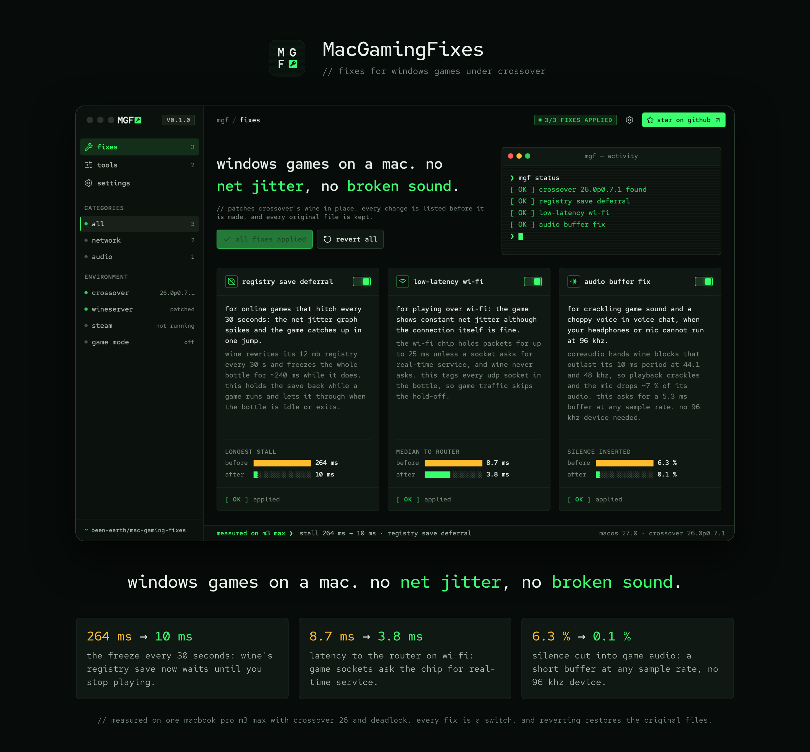

<p align="center">
  
</p>

# MacGamingFixes: fix stutter, net jitter and crackling sound in CrossOver games on Mac

Playing CS2, Deadlock or another Windows game on a Mac through CrossOver? Three things go wrong there
that no game setting or macOS setting fixes: the game **stutters every 30 seconds**, Wi-Fi shows
**constant net jitter** and late packets, and the **sound crackles** while your **mic cuts out** in
voice chat. MacGamingFixes (MGF) is a small macOS app for Apple silicon that removes all three by
patching CrossOver's Wine, and keeps two chores one click away: **F1–F12 without holding Fn**, and
switching **headphones and microphone** before a match. Every fix is a switch, and switching it off
puts the original files back.

**[Download the latest release](https://github.com/been-earth/mac-gaming-fixes/releases/latest)** ·
interface in English and Russian · [по-русски](#по-русски)

## Symptoms it fixes

| Symptom | Why it happens | The fix | Measured |
|---|---|---|---|
| **CS2 or Deadlock stutters every 30 seconds on Mac**: the game freezes for a quarter of a second, the net jitter graph spikes and the game catches up in one jump | Wine rewrites its registry every 30 s and freezes the whole bottle while it does | **registry save deferral** holds the save back while a game runs and lets it through when the bottle is idle or exits | longest stall 264 ms → 10 ms |
| **High net jitter in CS2 on Mac over Wi-Fi** although the connection itself is fine: packets arrive late, in bursts | The Wi-Fi chip holds packets for up to 25 ms unless a socket asks for real-time service, and Wine never asks | **low-latency wi-fi** tags every UDP socket in the bottle | median to the router 8.7 ms → 3.8 ms, late packets 25 % → 1.2 % |
| **Crackling, popping sound in CrossOver games and a choppy mic in voice chat**, unless the audio device runs at 96 kHz | At 44.1 and 48 kHz CoreAudio hands Wine blocks that outlast Wine's 10 ms period | **audio buffer fix** asks for a 5.3 ms buffer at any sample rate | silence inserted 6.3 % → 0.1 %, microphone audio lost 6.9 % → 0.2 % |

The numbers come from one MacBook Pro (M3 Max) with CrossOver 26 and Deadlock. Each fix has an
article in the app with the method and the figures; the same articles are the Markdown files in
`Sources/MGF/Resources/en.lproj` and `ru.lproj`.

Two tools change ordinary macOS settings and nothing inside CrossOver:

- **function keys** switches the top row between F1–F12 and the brightness and media keys at once,
  without logging out: by hand, while the apps you pick are running, or with macOS Game Mode.
- **audio devices** sets the system output, the microphone and its input level, and warns when a
  Bluetooth headset microphone would drop the headphones to phone quality.

## Is this my problem?

### CS2 or Deadlock stutters every 30 seconds on Mac (CrossOver, Steam)

Steady FPS, then a hitch like clockwork every 30 seconds, and the net graph or the Deadlock telemetry
shows a jitter spike at the same moment. That is Wine's registry save, not your network or GPU: the
Wine server rewrites `system.reg` (12 MB in a Steam bottle) and every process in the bottle waits
about 240 ms. Lower graphics settings change nothing; **registry save deferral** removes the stall.

### High net jitter or packet loss in CS2 on Mac over Wi-Fi

Two different things. Jitter that shows up only on the Mac, with a connection that is otherwise fine,
is usually the Wi-Fi chip's power saving: it holds packets for up to 25 ms unless a socket asks for
real-time service, which native games do and Wine does not. **Low-latency wi-fi** fixes that part.
Packet loss measured past your router (the provider, the game relay) is not on your Mac and nothing
here changes it; `ping` your router and then a relay to tell the two apart. Playing on battery adds
spikes of 100 ms and more on top of everything: plug the charger in.

### Crackling, popping audio in CrossOver games; mic cuts out in Discord or voice chat

The usual advice is to set the output device to 96 kHz in Audio MIDI Setup. It works because at 96 kHz
CoreAudio's 512-frame block is shorter than Wine's 10 ms audio period. Bluetooth headsets and most USB
microphones cannot run at 96 kHz, so at 44.1 or 48 kHz playback gets silence inserted and the
microphone loses about 7 % of what you say. **Audio buffer fix** asks CoreAudio for the short block at
any sample rate, so the 96 kHz device is no longer needed. A separate trap: when macOS picks a
Bluetooth headset's own microphone as the input, the headset drops to 16 kHz mono; the audio devices
tool warns about it.

### F1–F12 do not work in games on a MacBook without Fn

macOS has the switch (Keyboard → "Use F1, F2, etc. keys as standard function keys"), buried and manual.
**Function keys** flips it at once: by hand, or automatically while the game you pick is running or
macOS Game Mode is on.

### Does it work with Whisky, Game Porting Toolkit, Parallels, or native Steam games?

Not yet. The app patches the CrossOver bundle only (tested with CrossOver 26). Whisky and Game Porting
Toolkit lay their Wine out the same way but ship an older Wine (7.7 against CrossOver's 11), so at least
the audio wrapper would need its own build. Parallels is a virtual machine, not Wine. Native Mac games
(Dota 2, for one) never had these problems. If you want Whisky support, open an issue or write to
contact@been.earth.

### Which games and which Macs?

The fixes act on the bottle, not on a game: everything in the same CrossOver bottle gets them, and the
Steam bottle usually holds all your games. Measured with Deadlock; CS2 runs in the same bottle. One
machine so far: MacBook Pro M3 Max, macOS 27, CrossOver 26.0. Apple silicon only.

## Install

1. Download `MacGamingFixes-<version>.dmg` from
   [Releases](https://github.com/been-earth/mac-gaming-fixes/releases/latest) and open it.
2. Drag MacGamingFixes into Applications.
3. Allow the first launch, as described below.
4. Open the app. The setup takes a minute: language, where CrossOver is, one macOS permission, which
   fixes to apply.
5. Restart whatever runs in the bottle: Steam, or the game started from CrossOver. Anything already
   running keeps the old files, and the app names what to restart after every apply.

### After a CrossOver update

A CrossOver update, or a CXPatcher re-patch, replaces the patched files, so the fixes are gone until
they are applied again. Open MacGamingFixes once after updating: by default it notices and puts the
fixes back (`settings → fixes → re-apply fixes after a crossover update`); with that off, it warns and
leaves the switches to you. The same holds for any Wine distribution: the fix lives in files the update
overwrites.

### The first launch: this build is not signed by Apple

There is no Apple Developer certificate behind this project, so the app is signed ad hoc and is not
notarized. macOS stops such an app the first time and says it could not verify it. Allow it in one
of two ways:

- **System Settings.** Try to open the app and close the warning. Then open System Settings →
  Privacy & Security, scroll down to the message about MacGamingFixes and press **Open Anyway**.
  On macOS 14, right-clicking the app and choosing Open does the same.
- **Terminal.** Remove the download flag, then open the app as usual:

  ```sh
  xattr -dr com.apple.quarantine /Applications/MacGamingFixes.app
  ```

If macOS says the app "is damaged and can't be opened", it is the same block: use the Terminal command.
You do not have to trust the download: the source is all here, and `make build` produces the app.

## Requirements

- A Mac with Apple silicon. The release build is arm64 only.
- macOS 14 or later. It is built and tested on macOS 27.0; earlier versions are untested.
- [CrossOver](https://www.codeweavers.com/crossover), tested with CrossOver 26.0 (an install patched
  by CXPatcher; the two files the fixes replace are CrossOver's own). The fixes patch CrossOver's Wine;
  other Wine builds (Whisky, Game Porting Toolkit, Homebrew) are not supported.
- The App Management permission (System Settings → Privacy & Security), which the setup asks for.
  No admin password, no SIP changes, no Full Disk Access.
- Nothing else to install: the two libraries that go inside CrossOver ship in the app. Xcode is needed
  only to build from source.

The tools need neither CrossOver nor the permission.

## What it changes on your Mac

The three fixes are written inside the CrossOver bundle (the path is a setting). Every original file
is kept next to its replacement and `revert all` puts them back:

- `bin/wineserver` becomes a wrapper script; the original is `wineserver.orig`
- `lib/wine/x86_64-unix/winecoreaudio.so` becomes a wrapper library; the original is `winecoreaudio.so.orig`

macOS does not let one app change another until you allow it: the setup asks you to turn on
**System Settings → Privacy & Security → App Management** for the app, and `settings → app` shows whether
it is allowed. There is no API to ask macOS, so the app opens CrossOver's Wine server for writing and
closes it again without writing. The app lists the files before it writes anything. Function keys and
audio devices change ordinary macOS settings and nothing inside CrossOver.

The first launch opens a setup: language, what the app fixes, where CrossOver is, the macOS permission,
the first apply. The setup cannot be skipped, applying the fixes can. `settings → app` runs it again.

## Build

Needs Xcode (Swift 5.10 or newer and clang). The font and icons are in the tree;
`node scripts/fetch-assets.mjs` downloads them again after you add an icon name to it.

```sh
make build   # build/MacGamingFixes.app
make dmg     # build/MacGamingFixes-<version>.dmg, the installer
make test    # core tests + the translation check
make run     # build and open
```

`make dmg` lets Finder lay the installer window out, so it needs a desktop session and the window
flashes on screen once. The picture behind the icons is `assets/dmg/background.png` and its 2x twin.

`MGF_SNAPSHOT=<dir> build/MacGamingFixes.app/Contents/MacOS/MacGamingFixes` renders every screen into
PNG files without opening a window or touching the system. Add `-AppleLanguages "(ru)"` for Russian.
The PNG files leave out the window's own title bar; `MGF_DRY=1` opens the real window on a model that
reads the system but never changes it, and saves no settings.

## Layout

- `Sources/MGFCore` — everything that touches the system: patching CrossOver (`Fixes.swift`), function
  keys and trigger logic, Game Mode, the process list, CoreAudio devices, the article parser.
- `Sources/MGF` — the SwiftUI app. `Hax.swift` is the design system (tokens and components),
  `AppModel.swift` the state, the rest are screens.
- `native/` — the two C libraries that end up inside CrossOver. `make payload` builds them for x86_64.
- `Tests/MGFCoreTests` — install and revert against a throwaway CrossOver tree, the wrapper script
  round trip, the write probe, the quarantine flag, triggers, the article parser, the grid.
- `scripts/` — app bundling, the installer, the translation check, the asset downloader.
- `assets/` — sources of the app icon and wordmark, and the installer's background.
- `docs/` — the picture at the top of this file and the page it is rendered from.

## Status

- Built and run on macOS 27.0 (Apple silicon) with CrossOver 26.0, on one machine. Minimum target is
  macOS 14.
- The fixes were confirmed in real play as installed by the shell scripts this app grew out of. The
  app's own build of the two libraries was then checked in Wine on a copy of CrossOver: the server
  starts, defers registry saves and flushes them on exit, and inserted silence drops from 2.4 % to
  0.0–0.7 % at 48 kHz. That build has not been through a match yet.
- The release is ad hoc signed and not notarized. macOS ties the App Management permission to the
  signature, so a local ad hoc build loses it on every rebuild;
  `MGF_SIGN_IDENTITY="Apple Development: …" make build` signs with a stable identity instead.
- Two steps follow how macOS is documented to behave and have not been tested end to end: opening the
  downloaded build past Gatekeeper, and the permission switching to "allowed" once it is granted.
- `activateSettings` (function keys) and the Game Mode notification are undocumented macOS interfaces.

## Authors and contact

- Ilia Novikov ([@ilianovi3](https://github.com/ilianovi3)) — author and maintainer.

Bug reports, questions, and bottles that are not CrossOver:
[issues](https://github.com/been-earth/mac-gaming-fixes/issues) or **contact@been.earth**.

## License

[MIT](LICENSE).

Third-party, with their own licenses:

- [Red Hat Mono](https://github.com/RedHatOfficial/RedHatFont), SIL Open Font License 1.1 (`Sources/MGF/Resources/Fonts/OFL.txt`)
- [Lucide](https://lucide.dev) icons, ISC (`Sources/MGF/Resources/Icons/LICENSE`)

MacGamingFixes is not affiliated with CodeWeavers, Valve or Apple.

## По-русски

Windows-игры на Mac через CrossOver: **CS2 и Deadlock лагают каждые 30 секунд**, по Wi-Fi
**высокий net jitter**, **звук трещит**, а **микрофон заикается** в голосовом чате. MacGamingFixes —
приложение для macOS на Apple silicon, которое убирает все три проблемы патчем Wine внутри CrossOver,
и два инструмента рядом: **F1–F12 без Fn** и выбор наушников и микрофона перед матчем. Интерфейс на
русском, у каждого фикса — статья с замерами, любой фикс отключается одним переключателем.

- Установка: скачать `.dmg` из [релизов](https://github.com/been-earth/mac-gaming-fixes/releases/latest),
  перетащить в «Программы», разрешить первый запуск. Сборка без сертификата Apple, поэтому macOS
  остановит её один раз: Системные настройки → Конфиденциальность и безопасность → «Всё равно
  открыть», или в терминале `xattr -dr com.apple.quarantine /Applications/MacGamingFixes.app`.
- После применения перезапустите Steam или игру: уже запущенные используют старые файлы.
- После обновления CrossOver фиксы слетают: откройте приложение, оно вернёт их само.
- Whisky и Game Porting Toolkit пока не поддерживаются.
- Вопросы и баги: contact@been.earth.
